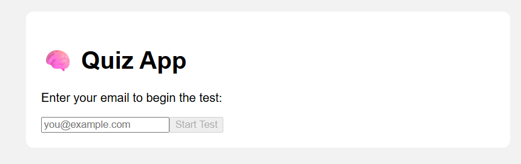
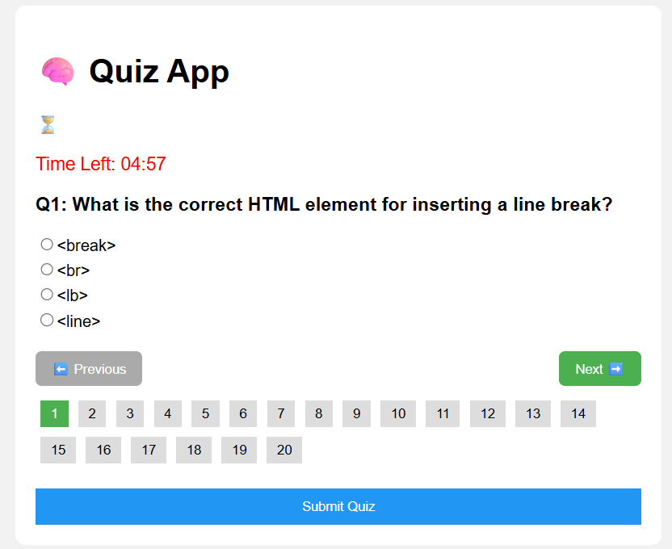
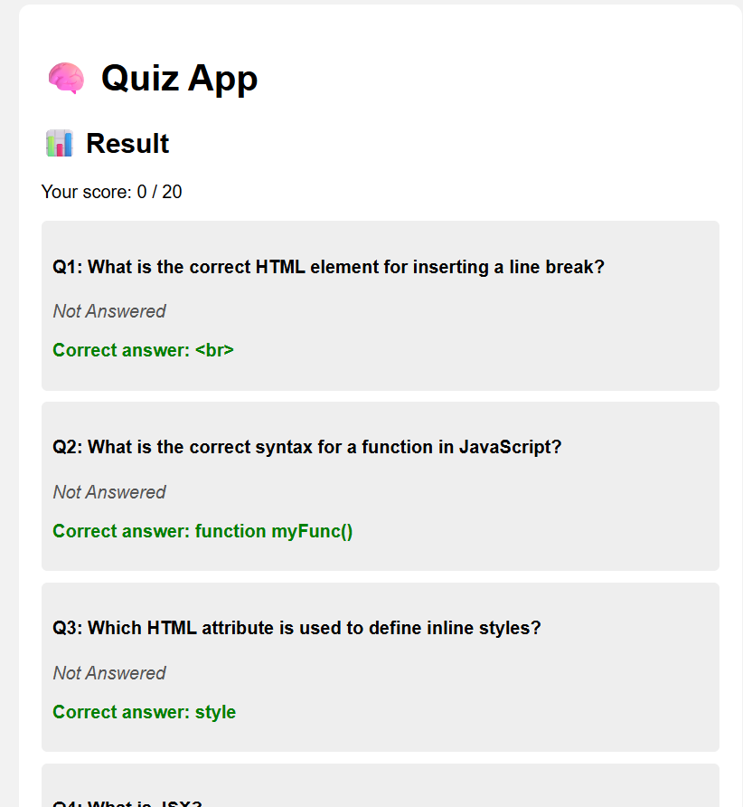
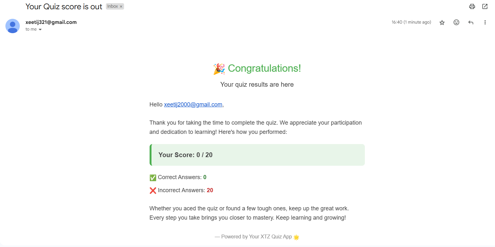

# Quiz App 🧠

A React-based Quiz Application that lets users answer multiple-choice questions within a time limit. It features navigation between questions, real-time timer, result display, and the ability to restart the quiz. The app also sends quiz results via email using EmailJS.

---

## Features

- Multiple-choice questions with radio button selection  
- Navigate between questions with Previous, Next, and direct question number buttons  
- Timer with countdown and auto-submit when time expires (default 5 minutes)  
- Submit quiz manually anytime  
- Results page showing score, correct and wrong answers, and question-wise feedback  
- Restart quiz functionality to attempt again with new random questions  
- Email result summary to user via EmailJS integration  
- Responsive and simple UI  

---

## Demo

| Start | Quiz | Result | Email |
|-------|------|--------|-------|
|  |  |  |  |

---

## Usage

- Enter your email and click Start Test to begin.

- Answer the questions using radio buttons.

- Navigate questions using Previous, Next, or the numbered buttons.

- Watch the countdown timer; the quiz auto-submits when time runs out.

- Submit the quiz manually anytime using the Submit Quiz button.

- View your detailed results with correct answers and your score.

- Click Start Again to retake the quiz with a new set of questions.

---

## Technologies Used

- ReactJS with functional components and hooks

- EmailJS for sending quiz result emails

- CSS for styling

---
